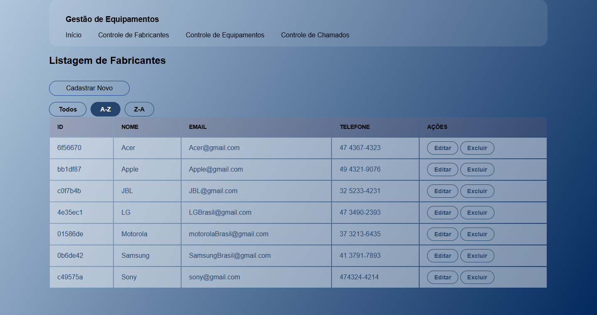
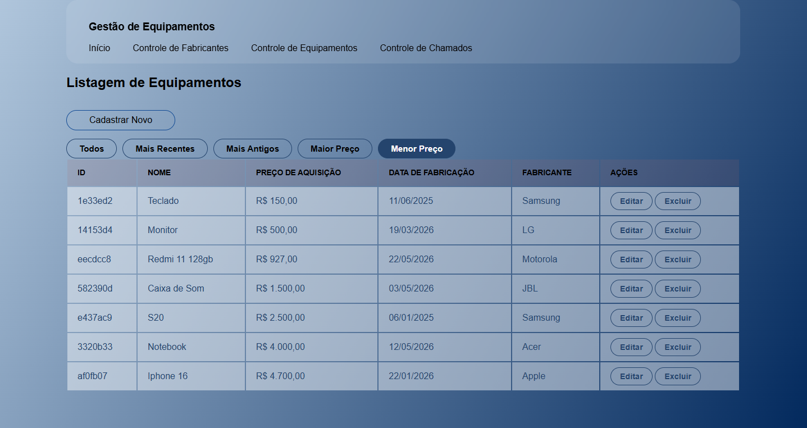
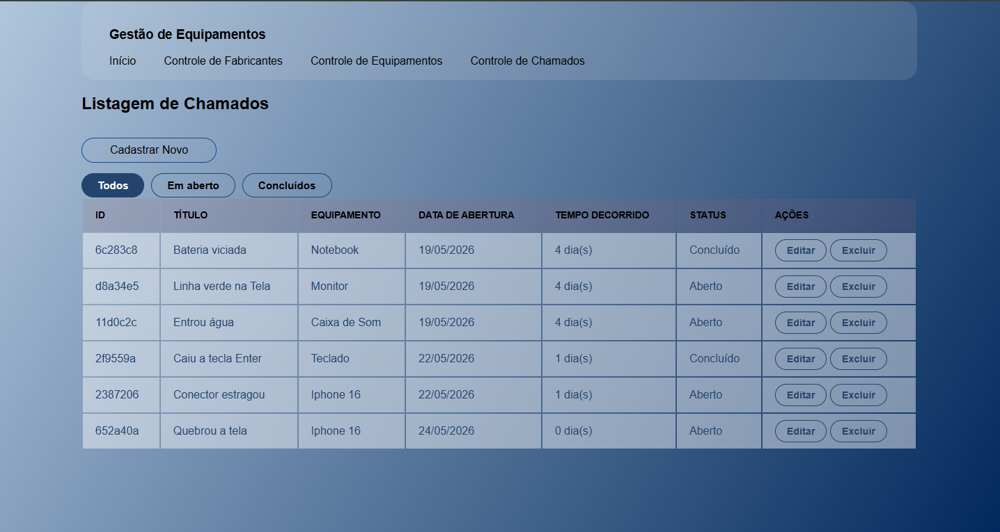

# Gestão de Equipamentos web

Sistema web desenvolvido para gerenciamento de equipamentos, fabricantes e chamados de manutenção.

Desenvolvido por **Iago** durante o curso Fullstack da [Academia do Programador](https://www.academiadoprogramador.net) 2026.


## Funcionalidades
* Página Inicial
* Interface moderna e responsiva;
* Apresentação do sistema;
* Navegação entre os módulos.

## Controle de Fabricantes



Permite gerenciar os fabricantes cadastrados no sistema.

Funcionalidades:
* Cadastrar novo fabricante;
* Visualizar todos os fabricantes;
* Editar fabricantes;
* Excluir fabricantes;
* Ordenar fabricantes de A-Z;
* Ordenar fabricantes de Z-A.

## Controle de Equipamentos



Responsável pelo gerenciamento dos equipamentos cadastrados.

Funcionalidades:
* Cadastrar novo equipamento;
* Visualizar todos os equipamentos;
* Editar equipamentos;
* Excluir equipamentos;
* Ordenar por equipamentos mais antigos;
* Ordenar por equipamentos mais recentes;
* Ordenar por maior preço;
* Ordenar por menor preço.

##  Controle de Chamados



Módulo para gerenciamento de chamados técnicos e manutenção.

Funcionalidades:
* Cadastrar novo chamado;
* Visualizar todos os chamados;
* Editar chamados;
* Excluir chamados;
* Filtrar chamados em aberto;
* Filtrar chamados concluídos.

## Tecnologias Utilizadas
C#
ASP.NET MVC
Razor Pages (.cshtml)
HTML
CSS

## Objetivo do Projeto

O sistema foi desenvolvido com o objetivo de praticar:
* desenvolvimento web com ASP.NET MVC;
* organização de sistemas CRUD;
* filtros e ordenações;
* estilização de interfaces;
* arquitetura em camadas;
* manipulação de listas e ViewModels.

## Como utilizar

1. Clone o repositório ou baixe o código fonte.
2. Abra o terminal ou o prompt de comando e navegue até a pasta raiz
3. Utilize o comando abaixo para restaurar as dependências do projeto.

    ```bash
    dotnet restore
    ```

4. Para executar o projeto compilando em tempo real

    ```bash
    dotnet run --project GestaoDeEquipamentosWeb.ConsoleApp
    ```

## Requisitos

- .NET 10.0 SDK